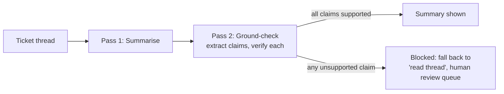

# spec-to-ship

**An LLM feature built the way I ship AI at work: spec first, guardrail second, evals before release.**

This repo is a working, end-to-end demonstration of how I take an AI feature from product spec to shippable: a support-ticket summariser whose output is gated by a groundedness check, with two eval suites that measure both the feature and the guardrail. It exists because "we added AI" is easy, and "we can prove it does not invent facts" is the actual job.

Built by [Karan Gupta](https://www.linkedin.com/in/guptakaran786/), AI Product Manager.

## The workflow this repo demonstrates

1. **[PRD.md](PRD.md)**, written before the code: problem, users, success metrics, eval plan, guardrails, rollout. The eval targets in the PRD are the release gate, not an afterthought.
2. **Prototype**: a two-pass pipeline, small enough to read in ten minutes.
3. **Evals**: one command runs both suites and writes [evals/RESULTS.md](evals/RESULTS.md). Ship only when targets are met.



## Why the guardrail is the product

A support summary that invents a refund, a date, or a promise is worse than no summary. So the design inverts the usual demo: the summariser is ordinary; the **ground-check is the feature**. Every claim in the summary is extracted and verified against the source. One unsupported claim blocks the summary entirely. Blocked means blocked: the fallback is "no summary", never "probably fine".

And because an unmeasured guardrail is decorative, the checker has its own eval suite: fixture summaries with planted hallucinations next to known-good claims, measuring whether the guardrail catches what it must (recall) without flagging what it should not (precision).

## Quickstart

Python 3.10+, no dependencies.

```bash
# no API key: deterministic extractive baseline (also what CI would run)
python -m src.run_eval --mock

# real model: set one key, then run
export ANTHROPIC_API_KEY=...   # or OPENAI_API_KEY
python -m src.run_eval
```

Results are written to `evals/RESULTS.md` with the run date, mode, and model.

## Eval design

- **Suite A, summariser quality (16 synthetic cases).** Billing disputes, login failures, escalations, multi-issue threads, contradictions, outages. Each case defines required facts (with accepted alternative phrasings) and **bait**: plausible details deliberately absent from the source, such as refund amounts and ship dates. Pass requires all facts present, zero bait, and a clean ground-check.
- **Suite B, checker quality (6 trap cases).** Fixture summaries with labelled unsupported claims planted beside labelled supported ones. Reports hallucination recall and supported-claim precision for the guardrail itself.
- All data is synthetic and written for this repo.

## Results

The committed [evals/RESULTS.md](evals/RESULTS.md) shows the latest run. The no-LLM extractive baseline (mock mode) scores low on Suite A by design; that gap between baseline and model is what the harness measures. Targets, defined in the PRD before build: Suite A ≥ 90%, checker recall ≥ 90%, checker precision ≥ 80%.

## Design decisions

- **Two passes, not one.** Asking a model to "summarise accurately" is a request; verifying each claim independently is a control. Controls beat requests in production.
- **Block, do not soften.** A summary with one unsupported claim is hidden entirely rather than shown with a warning. Warnings train users to ignore warnings.
- **Deterministic checks plus model checks.** Required-fact and bait checks are plain string logic (reproducible, free); groundedness uses a model. Cheap deterministic layers catch failures before expensive ones run.
- **Mock mode as a baseline, not a stub.** The no-LLM mode is a real extractive baseline, so the eval report always has a comparison point and CI can run without keys.
- **Traps for the guardrail.** Suite B exists because the failure mode of a safety check is silent: it looks like it is working right up until it is not measured.

## What I would build next

Claim-level confidence scores surfaced to reviewers, a drift eval run on a schedule against the live model version, and an amend flow where a human fixes a blocked summary and the fix feeds the eval set.

## License

MIT
