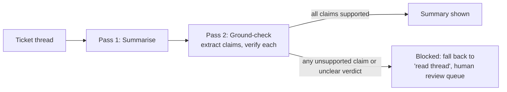

# spec-to-ship

**An LLM feature taken from spec to release: spec first, guardrail second, evals before release.**

**Try it in your browser:** a no-setup demo of this guardrail design is [Exhibit 01 on my portfolio](https://kgupta2095.github.io/#guardrail).

This repo is a working, end-to-end demonstration of how I take an AI feature from product spec to shippable: a support-ticket summariser whose output is gated by a fact check against the source (groundedness check), with two eval suites that measure both the feature and the guardrail. It exists because "we added AI" is easy, and "we can prove it does not invent facts" is the actual job.

Built by [Karan Gupta](https://www.linkedin.com/in/guptakaran786/), Product Manager. An independent personal project on synthetic data; not deployed.

## The workflow this repo demonstrates

1. **[PRD.md](PRD.md)**, written before the code: problem, users, success metrics, eval plan, guardrails, rollout. The eval targets in the PRD are the release gate, not an afterthought.
2. **Prototype**: a two-pass pipeline, small enough to read in ten minutes.
3. **Evals**: one command runs both suites, writes the results and enforces the release gate: a model run that misses any PRD target exits with an error, so CI goes red.


```mermaid
flowchart LR
    A[Ticket thread] --> B[Pass 1: Summarise]
    B --> C[Pass 2: Ground-check\nextract claims, verify each]
    C -->|all claims supported| D[Summary shown]
    C -->|any unsupported claim or unclear verdict| E[Blocked: fall back to\n'read thread', human review queue]
```

## Why the guardrail is the product

A support summary that invents a refund, a date, or a promise is worse than no summary. So the design inverts the usual demo: the summariser is ordinary; the **ground-check is the feature**. Every claim in the summary is extracted and verified against the source. One unsupported claim blocks the summary entirely. Blocked means blocked: the fallback is "no summary", never "probably fine".

The check also fails closed. A claim passes only when the checker's reply starts with SUPPORTED. An empty, garbled or hedged reply ("NO", "Not supported", "I think it is supported") counts as unsupported, so a broken checker blocks summaries instead of waving them through. [tests/test_groundcheck.py](tests/test_groundcheck.py) holds those trap replies.

And because an unmeasured guardrail is decorative, the checker has its own eval suite: fixture summaries with planted made-up facts (hallucinations) next to known-good claims, measuring whether the guardrail catches what it must (recall) without flagging what it should not (precision).

## Quickstart

Python 3.10+, no dependencies. Commands use `python3` (stock macOS has no `python`).

```bash
# 1. No API key needed: the deterministic no-LLM baseline.
#    Writes evals/RESULTS.mock.md. Never touches evals/RESULTS.md.
python3 -m src.run_eval --mock

# 2. Unit tests: the guardrail fails closed and the release gate is enforced (no key, no network).
python3 -m unittest -v

# 3. Real model: set one key, then run.
#    Writes evals/RESULTS.md and exits 1 if any PRD target is missed.
export ANTHROPIC_API_KEY=...   # or OPENAI_API_KEY
python3 -m src.run_eval
```

| How it runs | Writes | Release gate |
|---|---|---|
| `--mock`, or no key set | `evals/RESULTS.mock.md` (identical on every run) | Not enforced: the baseline is the comparison point and is meant to score low |
| A model key is set | `evals/RESULTS.md`, labelled with model and date | Exits 1 if Suite A < 90%, checker recall < 90% or checker precision < 80% |
| CI: [eval.yml](.github/workflows/eval.yml), manual trigger | `evals/RESULTS.md`, committed whether the gate passed or failed | Stops before running if neither key secret is set, so baseline numbers can never be committed as a model run |
| CI: [tests.yml](.github/workflows/tests.yml), every push | Nothing | Unit tests plus the mock baseline; fails if the mock run changes any committed results file |

## Eval design

- **Suite A, summariser quality (16 synthetic cases).** Billing disputes, login failures, escalations, multi-issue threads, contradictions, outages. Each case defines required facts (with accepted alternative phrasings) and **bait**: plausible details deliberately absent from the source, such as refund amounts and ship dates. Pass requires all facts present, zero bait, and a clean ground-check.
- **Suite B, checker quality (6 synthetic trap cases).** Fixture summaries with labelled made-up claims planted beside labelled true ones. Reports how many made-up claims the checker catches (hallucination recall) and how many true claims it keeps (supported-claim precision).
- **Unit tests.** Trap replies for a broken checker (empty, garbled, hedged) and the release gate rule. They run without a key or network.
- All data is synthetic and written for this repo.

## Results

Targets, set in the [PRD](PRD.md) before build: Suite A ≥ 90%, checker recall ≥ 90%, checker precision ≥ 80%. The latest model run is in [evals/RESULTS.md](evals/RESULTS.md); the baseline is in [evals/RESULTS.mock.md](evals/RESULTS.mock.md).

### Eval history

One loop of eval-driven iteration. The eval checks themselves were not changed between runs.

| Step | What ran | Suite A | Recall | Precision | Label | Evidence |
|---|---|---|---|---|---|---|
| Baseline | No-LLM extractive baseline, run locally | 5/16 (31%) | 86% | 100% | Synthetic (deterministic baseline, not a model run) | [RESULTS.mock.md](evals/RESULTS.mock.md) |
| Run 1 | claude-sonnet-4-5 in CI | 14/16 (88%), below the bar | 100% | 100% | Recorded model run (claude-sonnet-4-5, 2026-08-23) | [Actions run](https://github.com/kgupta2095/spec-to-ship/actions/runs/32624097237) · [results](https://github.com/kgupta2095/spec-to-ship/blob/373cbe88345542beaa2735eb855538d061411fd5/evals/RESULTS.md) |
| Fix | One targeted prompt change: keep stated timing, and report a customer request as a request, not a commitment | | | | | [commit 8686667](https://github.com/kgupta2095/spec-to-ship/commit/86866671906058d89d98333d62f7e30669c3c409) |
| Run 2 | claude-sonnet-4-5 in CI | 16/16 (100%) | 100% | 100% | Recorded model run (claude-sonnet-4-5, 2026-08-23) | [Actions run](https://github.com/kgupta2095/spec-to-ship/actions/runs/32624563591) · [results](https://github.com/kgupta2095/spec-to-ship/blob/2dfd93db5e7435dc34269f6a82db892950396656/evals/RESULTS.md) |

Run 1 surfaced two failures: a dropped timing detail in a multi-issue thread (S05, "from the next invoice") and one unsupported claim in the outage report (S07, a customer request reported as a commitment). The one prompt change fixed both.

Two honest notes on those runs. Run 1 went green in CI at 88% because the runner did not enforce the gate at the time; it now exits 1 below the bar, so the same run would be red today. And both recorded runs used the earlier, looser reading of the checker's reply; the next model run will re-measure under the fail-closed rule.

## Design decisions

- **Two passes, not one.** Asking a model to "summarise accurately" is a request; verifying each claim independently is a control. Controls beat requests in production.
- **Block, do not soften.** A summary with one unsupported claim is hidden entirely rather than shown with a warning. Warnings train users to ignore warnings.
- **Fail closed.** Only a clear SUPPORTED passes. A guardrail that fails open looks fine right up until the checker breaks.
- **Deterministic checks plus model checks.** Required-fact and bait checks are plain string logic (reproducible, free); groundedness uses a model. Cheap deterministic layers catch failures before expensive ones run.
- **Mock mode as a baseline, not a stub.** The no-LLM mode is a real extractive baseline, so the eval report always has a comparison point and CI can run tests without keys. It writes its own file, so it can never overwrite the recorded model run.
- **The gate is code, not a promise.** The eval runner exits with an error when a model run misses a target, so a release cannot go green below the bar.
- **Traps for the guardrail.** Suite B exists because the failure mode of a safety check is silent: it looks like it is working right up until it is not measured. Suite B traps the checker's judgement; the unit tests trap its plumbing.

## Limitations

- Suite B is small: 7 planted made-up claims and 6 true ones across 6 traps (Synthetic). So the 100% recall in Run 2, a Recorded model run (claude-sonnet-4-5, 2026-08-23), is encouraging, not proof.
- The same model family writes and checks the summaries, so they may share blind spots.
- Required-fact and bait checks are string matches, so a correct paraphrase can fail a case and an unusual phrasing of bait can slip past.

## What I would build next

Claim-level confidence scores surfaced to reviewers, a drift eval run on a schedule against the live model version, and an amend flow where a human fixes a blocked summary and the fix feeds the eval set.

## Licence

MIT
